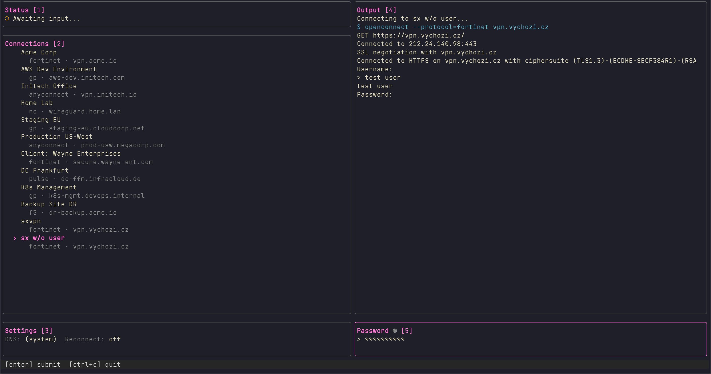

# lazyopenconnect

A TUI for managing OpenConnect VPN connections. Built with [Bubble Tea](https://github.com/charmbracelet/bubbletea).


## Quick Install

```bash
curl -fsSL https://raw.githubusercontent.com/Nybkox/lazyopenconnect/main/install.sh | bash
```

## Why?

FortiClient sucks. Sometimes it won't connect. Sometimes it won't reconnect. And the free version? Refuses to remember your password like it has trust issues.

Using the OpenConnect CLI directly works, but gets annoying fast. I stuck with a janky bash script for a while, but eventually decided this problem deserved a proper solution — a [lazygit](https://github.com/jesseduffield/lazygit)-style TUI that just works.

## Features

- **Connection management** - Create, edit, delete VPN profiles
- **Multi-pane interface** - Status, connections, settings, output log, and input in one view
- **Secure password storage** - Passwords stored in system keychain (macOS Keychain, Linux Secret Service, Windows Credential Manager)
- **Auto-reconnect** - Automatically reconnect when connection drops (configurable)
- **External VPN detection** - Detects and displays OpenConnect processes started outside the TUI
- **Interactive prompts** - Handle 2FA, OTP, and other authentication prompts directly in the TUI
- **Network cleanup** - One-key cleanup of routes, DNS, and interfaces after disconnect
- **Vim-style navigation** - `j/k` for movement, `g/G` for top/bottom, `ctrl+d/u` for page scroll

## Screenshots



## Installation

### Quick Install (Recommended)

```bash
curl -fsSL https://raw.githubusercontent.com/Nybkox/lazyopenconnect/main/install.sh | bash
```

Installs the latest release binary to `/usr/local/bin`.

### Homebrew

```bash
brew tap nybkox/tap
brew install lazyopenconnect
```

### Download Binary

Download the latest release from [GitHub Releases](https://github.com/Nybkox/lazyopenconnect/releases):

| Platform | Architecture | Download |
|----------|--------------|----------|
| macOS    | Intel        | `lazyopenconnect_*_darwin_amd64.tar.gz` |
| macOS    | Apple Silicon| `lazyopenconnect_*_darwin_arm64.tar.gz` |
| Linux    | x86_64       | `lazyopenconnect_*_linux_amd64.tar.gz` |
| Linux    | ARM64        | `lazyopenconnect_*_linux_arm64.tar.gz` |

```bash
# Extract and install
tar -xzf lazyopenconnect_*.tar.gz
sudo mv lazyopenconnect /usr/local/bin/
```

### From Source

```bash
git clone https://github.com/Nybkox/lazyopenconnect.git
cd lazyopenconnect
go build -o lazyopenconnect
sudo mv lazyopenconnect /usr/local/bin/
```

### Requirements

- **OpenConnect** - Must be installed and accessible in PATH
- **Root access** - Required for VPN operations
- **macOS** - Currently optimized for macOS (network cleanup commands)

Install OpenConnect:

```bash
# macOS
brew install openconnect

# Ubuntu/Debian
sudo apt install openconnect

# Fedora
sudo dnf install openconnect
```

## Usage

```bash
# Run (requires root)
sudo lazyopenconnect
```

## Configuration

Configuration is stored in `~/.config/lazyopenconnect/config.json`.

### Connection Options

| Field         | Description                                                           |
| ------------- | --------------------------------------------------------------------- |
| `name`        | Display name for the connection                                       |
| `protocol`    | VPN protocol: `gp` (GlobalProtect), `anyconnect`, `nc`, `pulse`, etc. |
| `host`        | VPN server hostname                                                   |
| `username`    | Login username (optional)                                             |
| `hasPassword` | Whether password is stored in keychain                                |
| `flags`       | Additional openconnect flags (e.g., `--servercert=...`)               |

### Settings

| Setting           | Description                             | Default           |
| ----------------- | --------------------------------------- | ----------------- |
| `dns`             | DNS servers to restore after disconnect | `1.1.1.1 1.0.0.1` |
| `reconnect`       | Auto-reconnect on connection drop       | `false`           |
| `autoCleanup`     | Run cleanup automatically on disconnect | `true`            |
| `wifiInterface`   | Wi-Fi interface name (for DNS restore)  | `Wi-Fi`           |
| `netInterface`    | Network interface name                  | `en0`             |
| `tunnelInterface` | VPN tunnel interface                    | `utun0`           |

## Supported Protocols

All protocols supported by OpenConnect:

- `anyconnect` - Cisco AnyConnect
- `gp` - Palo Alto GlobalProtect
- `nc` - Juniper Network Connect
- `pulse` - Pulse Secure
- `f5` - F5 BIG-IP
- `fortinet` - Fortinet FortiGate
- `array` - Array Networks

## Architecture

Follows an **App-State-Helpers** architecture built on Bubble Tea's Elm-style pattern:

**1. App (`pkg/app/`)** - Central orchestrator implementing Bubble Tea's `Model` interface. `update.go` routes messages to grouped handlers (`handlers_*.go`) for VPN events, pane navigation, input, and forms.

**2. State (`pkg/app/state.go`)** - Single source of truth. Connection status enum (Disconnected → Connecting → Prompting → Connected), pane focus, form state, output buffer, scroll positions. No state lives elsewhere.

**3. Helpers (`pkg/controllers/helpers/`)** - Business logic decoupled from UI. `vpn.go` spawns processes with PTY, streams output via channels, detects prompts. `config.go` persists JSON. `keychain.go` wraps system credential storage.

**4. Models (`pkg/models/`)** - Pure data structs with JSON tags. `Connection` (profile), `Settings` (preferences), `Config` (root).

**5. Presentation (`pkg/presentation/`)** - Pure render functions: State in → styled string out. Multi-pane layout, scrollbars, form overlays. No business logic.

## Tech Stack

- [Bubble Tea](https://github.com/charmbracelet/bubbletea) - TUI framework (Elm architecture)
- [Bubbles](https://github.com/charmbracelet/bubbles) - TUI components
- [Lip Gloss](https://github.com/charmbracelet/lipgloss) - Terminal styling
- [Huh](https://github.com/charmbracelet/huh) - Form components
- [go-keyring](https://github.com/zalando/go-keyring) - Cross-platform keychain
- [creack/pty](https://github.com/creack/pty) - PTY for process I/O

## Troubleshooting

### "Requires root" error

OpenConnect needs root privileges to create network interfaces. Always run with `sudo`.

### Network issues after disconnect

Press `c` in the Connections pane to run cleanup, which:

1. Brings down the tunnel interface
2. Flushes routing table
3. Restarts network interface
4. Restores DNS settings
5. Flushes DNS cache

### Password not being sent

Ensure "Save password" is enabled when creating/editing the connection. Passwords are stored securely in your system keychain.

### Connection drops immediately

Check the Output pane for error messages. Common issues:

- Server certificate not trusted - add `--servercert=<hash>` to flags
- Missing dependencies - ensure OpenConnect is installed
- Wrong protocol - try different protocol options

## License

MIT
